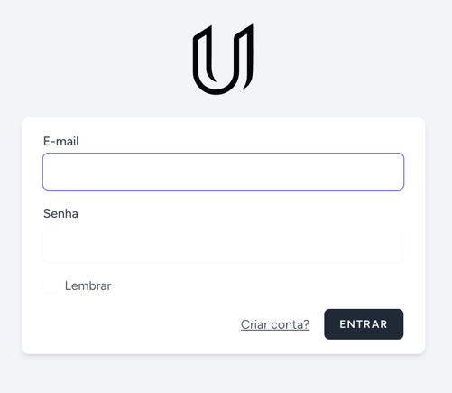
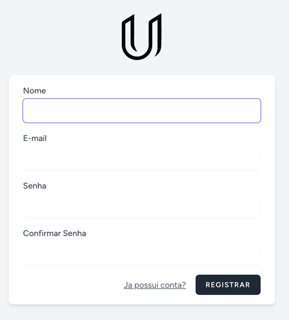
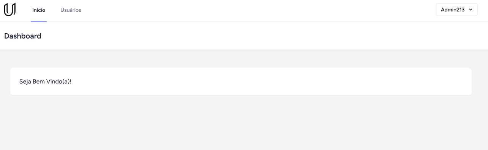
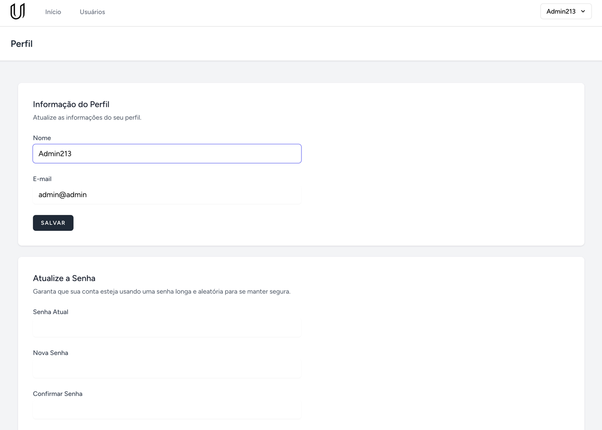
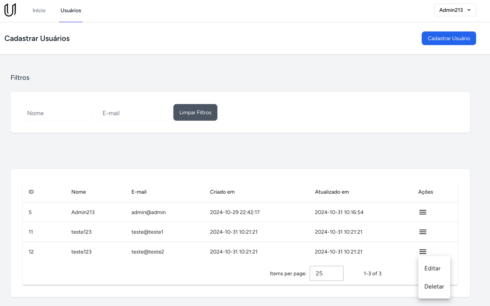

# Guia de Instalação do Projeto Laravel com Vue.js - Umentor
+ Este guia descreve o processo de instalação de um projeto Laravel com Vue.js. Siga os passos abaixo para configurar o ambiente e rodar o projeto.

+ O projeto é um CRUD simples de usuários, com autenticação e validação de formulários. O frontend foi desenvolvido com Vue.js e o backend com Laravel, utilizando de DataTables e Laratables para listagem e pesquisa inteligente.

## 1. Clonar o Repositório

Primeiro, clone o repositório do projeto usando o Git:

```bash
git clone https://github.com/GuilhermeTiede/teste_umentor.git
```

## 2. Instalar Dependências do Laravel
Navegue até o diretório do projeto e instale as dependências do Laravel com o Composer:

```bash Copiar código
cd teste_umentor
composer install
```
## 3. Instalar Dependências do Frontend
Em seguida, instale as dependências do frontend usando o Yarn:

```bash Copiar código
yarn install
```
## 4. (Opcional) Configuração com Laravel Valet (Usuários de Mac)
Se você utiliza o Laravel Valet para gerenciar seu ambiente de desenvolvimento, execute os seguintes comandos para criar o link simbólico e habilitar o HTTPS:

```bash Copiar código
valet link
valet secure
```
Depois, acesse o link do repositório gerado pelo Valet no seu navegador.

## 5. Configuração do Arquivo .env
Edite o arquivo .env na raiz do projeto para configurar a conexão com seu banco de dados
MySQL. Certifique-se de definir as seguintes variáveis de ambiente:
```bash Copiar código
cp .env.example .env
php artisan key:generate
```

```makefile Copiar código
DB_CONNECTION=mysql
DB_HOST=127.0.0.1
DB_PORT=3306
DB_DATABASE=umentor
DB_USERNAME=root
DB_PASSWORD=password
```

## 6. Executar as Migrações
Após configurar o banco de dados, execute as migrações para criar as tabelas necessárias:

```bash Copiar código
php artisan migrate
```

## 7. Rodar o Projeto
Para iniciar o servidor de desenvolvimento e rodar o projeto, utilize o comando abaixo:

```bash Copiar código
yarn dev
```
Se preferir, você pode apenas gerar os arquivos de build para produção usando o Vite:

```bash Copiar código
yarn build
```
## 8. Acessar o Projeto
Se você configurou o Laravel Valet, acesse o projeto pelo link fornecido. Caso contrário, o projeto estará acessível através do servidor embutido do Laravel na URL padrão (http://localhost:8000).

Pronto! ambiente configurado e o projeto deve estar rodando corretamente.
Se algum imprevisto surgir não exitem em me chamar que estarei disposto a ajudar.


## Telas do Projeto:
Todas as validações estão presentes no Projeto, e estou disposto a entrar em uma reunião para apresentar o projeto, as tecnologias utilizadas e suas funcionalidades.

Tela de Login e Registro:






Tela Inicial:



Informações do perfil:


Tela de Cadastro de Usuários (Utilizando pesquisa inteligente e listagem inteligente com Datatables
e Laratables, ajustando as consultas AJAX no Laravel para retornar os dados de forma paginada):


